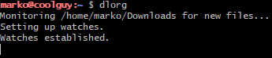
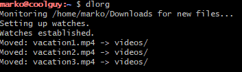

# dlorg_marko_tadic
### Linux Lab 2026 - Marko Tadic

# Download Organizer
## dlorg

'dlorg' is a tool designed to clean up and automatically organize the downloads directory by sorting files into dedicated subfolders based on their file extensions

## Features

**Real-time monitoring:** 
Uses ´inotifywait´ to actively monitor the downloads folder for newly created files or files moved to the directory and processes them instantly.

**Smart Categorization:**
Automatically routes files into 9 distinct directories:
* `docs` (Word, Excel, PowerPoint, etc.),
* `images` (JPG, PNG, GIF, SVG, etc.),
* `pdfs` (PDF documents),
* `text` (TXT, MD, RTF),
* `videos` (MP4, MKV, AVI, etc.),
* `audio` (MP3, WAV, FLAC, etc.),
* `installers` (EXE, MSI, DEB),
* `archives` (ZIP, TAR, RAR, 7z),
* `code` (Python, JS, HTML, C++, etc.)

**Loop Protection:**
Automatically ignores changes inside its destination subdirectories to prevent endless processing loops.

**Safe Validation:** 
Checks to ensure incoming files are valid before attempting to categorize them.

## Prerequisites

Before running the script in **Git Bash**, make sure you have `inotify-tools` package installed in your environment to provide the `inotifywait` command.

## Installation & Setup

To install, clone the repository and run the script:
```bash
git clone https://github.com/marko-tadic/dlorg_marko_tadic.git
./install.sh
```
## The install script
```
mkdir -p ~/.local/bin ~/.config/systemd/user/
cp dlorg ~/.local/bin/dlorg
chmod +x ~/.local/bin/dlorg
cp organizer-startup.service ~/.config/systemd/user/
systemctl --user daemon-reload
systemctl --user enable --now organizer-startup.service
```
*Note: If it does not work, try running `chmod +x install.sh`

## Done!
* How it should look once you're done and run ´dlorg´! 

  


* And when moving files: 
  
  


Good luck and have fun being organized!
